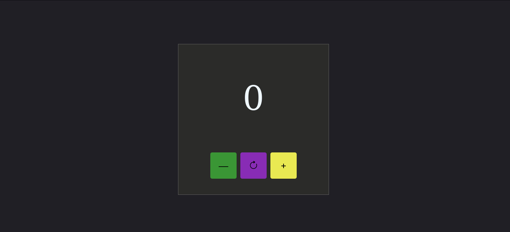

  <h1>Contador de cliques</h1>
    
    
    
     
     
     

Este projeto é um contador de cliques interativo, desenvolvido com HTML, CSS e JavaScript. Ele permite aumentar, diminuir ou zerar o valor exibido. Além disso, possui um design responsivo, garantindo compatibilidade e melhor experiência em diferentes dispositivos.

  
Desenvolvido por <a target="_blank" rel="external" href="https://github.com/MegMinnie/"><strong>Mirele Oliveira da Silva</strong></a>

 

 

  
  ## Como Acessar a Aplicação

Acesse a aplicação por meio do link: <a href="https://megminnie.github.io/Contador-de-Cliques/
"_blank">clique aqui</a>

## Screenshots

